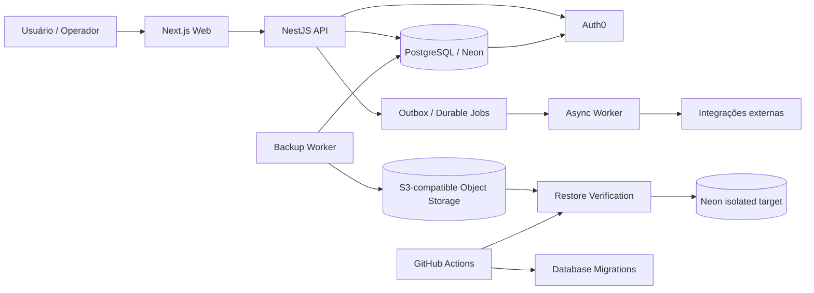

# TMS — Auditoria Geral, Estado Técnico e Checklist de Desenvolvimento

**Data da auditoria:** 2026-10-02  
**Repositório:** `alexoaraujo83/TMS`  
**Branch auditada:** `main`  
**HEAD auditado:** `2982600520dc2ff4046c33f2f713062893ea6f76`  
**Banco auditado:** Neon `shiny-hall-34679912`, branch `main`  
**Escopo:** arquitetura, código/documentação, CI/CD, Auth0, tenancy/IAM/RLS, banco/migrações, Web/API/Worker, backup/restore/DR, Vercel/Railway/Neon, PRs recentes e coerência documental.

## 1. Sumário executivo

O TMS possui uma fundação técnica consistente: monorepo TypeScript com Web Next.js, API NestJS, Worker assíncrono, PostgreSQL/Neon, multi-tenancy, IAM, RLS, outbox/durable jobs, auditoria, freight/matching, Trip Operations, Compliance/GR, Finance e uma cadeia de backup/restore com catálogo estruturado.

A auditoria encontrou **uma divergência documental material**: a documentação versionada ainda descrevia o banco em 0031/35 migrações e 21 tabelas públicas, enquanto o banco real auditado está em **0039 e 22 tabelas públicas**, incluindo `backup_manifests`. As migrações 0036–0039 e o estado de produção precisam ser tratados como a nova referência.

O fluxo de DR evoluiu significativamente: o catálogo estruturado de backups já existe no banco, o restore passou a derivar expectativas do manifesto selecionado e a UI possui console operacional/histórico. O PR #121 permanece **aberto e draft**, portanto as melhorias finais de auto-refresh/polling ainda não devem ser descritas como integradas ao `main`.

A evidência de produção deve continuar separando: **código implementado**, **CI comprovado**, **preview/deployment comprovado** e **prova runtime de produção**. Um deployment READY não substitui uma prova autenticada contra produção.

## 2. Arquitetura atual

### Diagrama de contexto



### Fluxo síncrono

```text
HTTP Request
  -> Auth0 authentication
  -> TenantContext
  -> PermissionGuard / authorization
  -> Use Case
  -> PostgreSQL transaction
  -> Audit + Outbox
  -> HTTP Response
```

### Fluxo assíncrono

```text
Committed transaction
  -> outbox_events
  -> worker claim / lease
  -> idempotent handler
  -> external side effect
  -> success/failure + retry
  -> audit/evidence
```

### Fluxo de backup/restore

```text
PostgreSQL
  -> Backup Worker
  -> encrypted dump
  -> SHA-256 + manifest
  -> S3-compatible storage
  -> backup_manifests
  -> /app/restore catalog
  -> selected backup object
  -> Restore Verification
  -> isolated Neon target
  -> structural / migration / integrity evidence
```

## 3. Estado real do banco

Consulta direta ao Neon em 2026-10-02:

| Item | Estado observado |
|---|---|
| PostgreSQL | 17.11 |
| Migration head | `0039_backup_manifests.sql` |
| Migrations aplicadas | 39 |
| Public tables | 22 |
| `backup_manifests` | presente; 1 manifesto; último registro 2026-10-02 02:03:30Z |
| Runtime role `tms_app` | NOSUPERUSER, NOBYPASSRLS, sem CREATEDB/CREATEROLE |
| `main` | ready, default, primary |
| `development` | archived |
| `staging` | archived |

### Migrações novas que devem constar na documentação

| Migration | Finalidade | Estado |
|---|---|---|
| 0036 | Auth0 identity bootstrap | aplicada |
| 0037 | Auth0 identity orphan relink | aplicada |
| 0038 | ownership/privileges de helpers SECURITY DEFINER para CI | aplicada |
| 0039 | catálogo estruturado `backup_manifests` | aplicada |

**Observação:** `backup_manifests` não é tenant-scoped e não possui RLS. O desenho de segurança depende do endpoint autorizado por Auth0 + `iam:manage` e da não exposição direta da tabela ao navegador. Esse ponto deve permanecer explicitamente documentado e coberto por regressão.

## 4. Segurança e tenancy

### Comprovado no código/documentação auditados

- Auth0 permanece o Identity Provider.
- Tenant membership e permissões permanecem autoridade TMS/PostgreSQL.
- Post-Login Action publica `tenant_id`, e-mail e display name em namespace próprio.
- Bootstrap Auth0 é idempotente.
- Claim de tenant não deve expandir silenciosamente uma identidade que já possua membership.
- Runtime `tms_app` não possui `BYPASSRLS`.
- Tabelas de negócio tenant-scoped possuem RLS.
- Relações críticas usam chaves compostas para impedir cross-tenant linkage.
- API usa guards de autenticação e permissão.
- O console de manifests exige `iam:manage`.

### Gate que continua exigindo evidência específica

A prova DB-04/E4 deve continuar sendo tratada como evidência runtime: sessão autenticada, `current_user=tms_app`, `NOBYPASSRLS`, SELECT cross-tenant bloqueado e tentativas de INSERT/UPDATE cross-tenant rejeitadas com rollback. Preview deployment não é substituto dessa prova.

## 5. Backup, Restore e DR

### Implementado

- backup PostgreSQL externo;
- criptografia;
- checksum;
- manifesto;
- verificação remota;
- catálogo estruturado persistido em PostgreSQL;
- endpoint de catálogo protegido;
- seleção de backup;
- restore verification isolado;
- PostgreSQL 17 client no runner;
- target de restore protegido contra padrões de produção/local;
- histórico de restore;
- expectativas derivadas do manifesto selecionado.

### Estado do trabalho

| Item | Estado |
|---|---|
| Catálogo estruturado | CONCLUÍDO / integrado |
| Derivação dinâmica das expectativas | CONCLUÍDO / integrado |
| Histórico de restore | CONCLUÍDO / integrado |
| Console DR | CONCLUÍDO / integrado |
| Autorização do catálogo | CONCLUÍDO / integrado |
| Auto-refresh/polling final da UI | EM ANDAMENTO — PR #121 draft |
| RPO/RTO aprovados pelo negócio | NÃO COMPROVADO |
| Política recorrente de DR operacionalmente evidenciada | NÃO COMPROVADO |
| Retenção operacionalmente testada de ponta a ponta | NÃO COMPROVADO |
| Receiver-side exactly-once para webhooks | NÃO COMPROVADO |

## 6. PRs recentes — auditoria de estado

| PR | Tema | Estado auditado |
|---|---|---|
| #121 | self-refreshing backup catalog | **OPEN / DRAFT / não mergeado** |
| #120 | restore catalog UX | CLOSED / não mergeado |
| #119 | backup manifest authorization regression | MERGED |
| #118 | dynamic restore expectations | MERGED |
| #117 | structured backup manifest catalog | MERGED |
| #116 | restore history | MERGED |
| #115 | DR control console | MERGED |
| #114 | verified backup catalog UI | MERGED |
| #113 | backup object selector | MERGED |
| #112 | PostgreSQL 17 path persistence | MERGED |
| #111 | safe empty response handling | MERGED |
| #110 | controlled Backup Now | MERGED |
| #109/#108/#107 | PostgreSQL 17 restore fixes | MERGED |
| #106 | restore verification control | MERGED |
| #105 | verify-full system CA | MERGED |
| #99 | DB-04 evidence console | MERGED |
| #98 | migration 0037 checksum preservation | MERGED |

## 7. Auditoria de documentação

### Divergências corrigidas nesta atualização

- migration head documental: 0031 -> 0039;
- contagem de migrações: 35 -> 39;
- contagem de tabelas públicas: 21 -> 22;
- inclusão de `backup_manifests`;
- inclusão das migrações 0036–0039;
- estado atual do DR e do catálogo estruturado;
- status do PR #121;
- separação entre implementação, evidência CI, preview e prova runtime;
- atualização do roadmap para distinguir concluído de gate operacional pendente.

### Regra documental reforçada

Qualquer alteração de código, schema, deployment, Auth0, integração ou UX operacional deve atualizar a documentação correspondente na mesma mudança. Evidência histórica não deve ser apresentada como estado atual.

## 8. Checklist geral — concluído, atual e futuro

| ID | Área | Item | Estado | Próxima evidência/ação |
|---|---|---|---|---|
| ARC-01 | Arquitetura | Monorepo Web/API/Worker | CONCLUÍDO | manter |
| ARC-02 | Arquitetura | Bounded contexts e regras de dependência | CONCLUÍDO | ADR para mudanças estruturais |
| ARC-03 | Arquitetura | Diagramas versionados | CONCLUÍDO | manter sincronizados |
| SEC-01 | Auth | Auth0 como IdP | CONCLUÍDO | regression suite |
| SEC-02 | Auth | Tenant Claim | CONCLUÍDO no código; runtime gate conforme evidência | repetir prova quando Action/deploy mudar |
| SEC-03 | IAM | membership/permission PostgreSQL authoritative | CONCLUÍDO | manter |
| SEC-04 | RLS | runtime `tms_app` NOBYPASSRLS | COMPROVADO no estado do role | DB-04 E2E |
| SEC-05 | RLS | cross-tenant negative tests | IMPLEMENTADO / evidência deve permanecer rastreável | executar em CI e runtime quando exigido |
| DB-01 | Banco | migrations forward-only | CONCLUÍDO | checksum CI |
| DB-02 | Banco | migration 0039 | CONCLUÍDO / aplicada | confirmar em cada promoção |
| DB-03 | Banco | backup_manifests | CONCLUÍDO | autorização + retenção |
| DB-04 | Banco | integridade de relações cross-tenant | CONCLUÍDO | regressão |
| API-01 | API | health/ready | CONCLUÍDO | monitorar |
| API-02 | API | auth + permission guards | CONCLUÍDO | regressão |
| API-03 | API | request observability | CONCLUÍDO | validar telemetria |
| WEB-01 | Web | app shell e módulos iniciais | CONCLUÍDO como foundation | evoluir domínio |
| WEB-02 | Web | Restore/DR console | CONCLUÍDO / integrado | PR #121 |
| WEB-03 | Web | catálogo auto-refresh/polling | ATUAL / PR #121 | corrigir CI, validar, merge humano |
| REL-01 | Reliability | outbox | CONCLUÍDO foundation | ampliar handlers |
| REL-02 | Reliability | durable jobs | CONCLUÍDO foundation | hardening/lease heartbeat |
| REL-03 | Reliability | webhook idempotency metadata | CONCLUÍDO | prova receiver-side |
| OPS-01 | Backup | backup worker | CONCLUÍDO | recorrência/evidência |
| OPS-02 | Backup | encrypted backup + checksum | CONCLUÍDO | monitorar |
| OPS-03 | Restore | isolated restore verification | COMPROVADO | repetir periodicamente |
| OPS-04 | DR | RPO aprovado | PENDENTE | decisão produto/operações |
| OPS-05 | DR | RTO aprovado | PENDENTE | decisão produto/operações |
| OPS-06 | DR | retention e ownership | PENDENTE / evidência operacional incompleta | teste controlado |
| OPS-07 | DR | monthly restore drill | PLANEJADO | automatizar calendário/evidência |
| DOM-01 | Master Data | carriers/drivers/vehicles | FOUNDATION CONCLUÍDA | ampliar entidades |
| DOM-02 | Freight | lifecycle | FOUNDATION CONCLUÍDA | ampliar quotation/negotiation/contracting |
| DOM-03 | Matching | ranking/assignment | FOUNDATION CONCLUÍDA | ampliar regras/capacidade |
| DOM-04 | Trip | execution/POD | FOUNDATION CONCLUÍDA | ampliar operação |
| DOM-05 | Compliance | checks/GR | FOUNDATION CONCLUÍDA | documentos/risk/block |
| DOM-06 | Finance | financial entries/invariants | FOUNDATION CONCLUÍDA | settlement/payment/reconciliation |
| DOM-07 | Analytics | KPIs/read models | PLANEJADO | iniciar após contratos de eventos estabilizados |
| DOM-08 | AI | optimization/forecasting | PLANEJADO | somente após dados confiáveis |
| QA-01 | QA | quality chain | CONCLUÍDO como pipeline | manter obrigatório |
| QA-02 | QA | security regression | CONCLUÍDO foundation | ampliar E2E |
| QA-03 | QA | load/performance | PENDENTE | benchmark |
| QA-04 | QA | production readiness review | PENDENTE | consolidar gates |
| DOC-01 | Docs | architecture docs | ATUALIZADO | manter junto do código |
| DOC-02 | Docs | database docs | ATUALIZADO | manter migration head |
| DOC-03 | Docs | project inventory | ATUALIZADO | auditoria periódica |
| DOC-04 | Docs | operational runbooks | PARCIAL | completar DR/retention/incident evidence |

## 9. Ordem recomendada de desenvolvimento futuro

1. **Fechar PR #121**: corrigir qualquer gate de CI restante, validar comportamento do catálogo, polling e auto-refresh, coletar evidência e realizar revisão/merge humano.
2. **Reconciliar documentação e evidências de produção** após o merge, principalmente SHA/deployment/migration head.
3. **Fechar DB-04/E4 runtime** com sessão autenticada e `tms_app`.
4. **Completar DR operacional**: recorrência, ownership, retention test, RPO, RTO e calendário de restore drill.
5. **Consolidar Reliability**: heartbeat/reclaim de Durable Jobs, DLQ/replay e observabilidade de webhooks.
6. **Expandir domínio** em sequência: Master Data -> Freight completo -> Matching/Capacity -> Trip -> Compliance -> Finance.
7. **Adicionar Analytics/read models** somente com contratos de eventos estáveis.
8. **Adicionar AI/optimization** somente sobre dados, permissões e eventos já auditáveis.
9. **Executar performance/security assessment** antes do production-readiness review final.

## 10. Conclusão da auditoria

O estado técnico observado é **coerente com uma fundação TMS SaaS em evolução para hardening operacional**, mas a documentação estava atrás do estado real do banco e do subsistema de DR. Essa inconsistência documental é corrigida por esta atualização.

Os principais gates que permanecem abertos são operacionais/evidenciais, não a existência básica da arquitetura: prova runtime DB-04/E4, fechamento do PR #121, DR recorrente com ownership/retention/RPO/RTO e hardening adicional de reliability.

**Regra de auditoria:** não promover um item de "implementado" para "produção comprovada" sem evidência correspondente do ambiente e período auditados.
