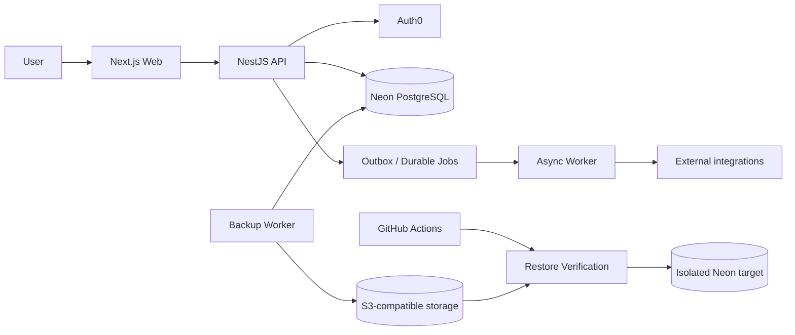
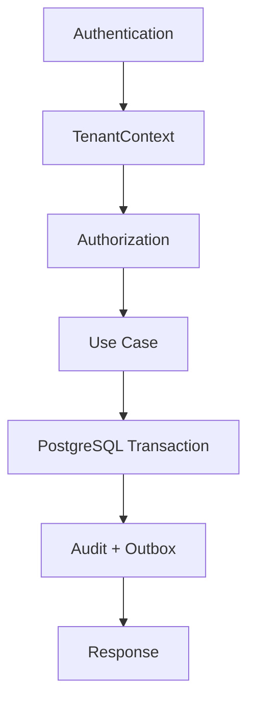
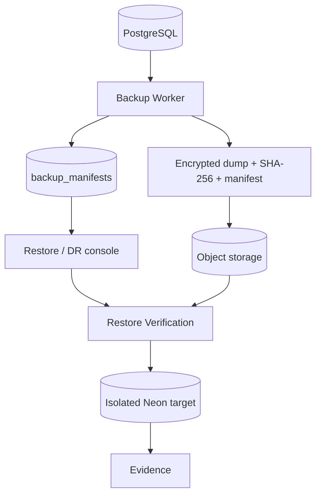

# TMS — Foundation Architecture

## Mission

Build a new TMS/SaaS from zero, independently from Nexora TMS, using Nexora only as a technical reference. No runtime dependency, shared database, copied application boundary, or fork relationship is allowed.

## Architectural principles

1. Multi-tenancy is a system invariant, not a feature added later.
2. Authentication, tenant resolution, authorization, business rules, persistence and audit are separate concerns.
3. PostgreSQL is the transactional source of truth.
4. Domain modules own their use cases and persistence boundaries.
5. The initial topology is a modular monolith plus an asynchronous worker.
6. Events are emitted through an outbox after successful transactions.
7. P0/P1 security or data-integrity findings block production promotion.
8. Financial operations require explicit idempotency and auditability.
9. The Web application consumes the API; business rules do not live only in the UI.
10. Every production capability must have code, authorization, tests, observability and documentation.

## Initial deployables

- `apps/web`: Next.js web application.
- `apps/api`: NestJS HTTP API.
- `apps/worker`: asynchronous jobs, outbox processing and integrations.
- `packages/database`: PostgreSQL schema, migrations and database utilities.
- `packages/contracts`: API/domain contracts shared without leaking persistence details.
- `packages/config`: validated environment/configuration primitives.
- `packages/observability`: logging, correlation and telemetry contracts.

## Domain boundaries

### Platform

Tenants, configuration, feature flags and platform administration.

### IAM

Users, identities, memberships, roles, permissions and authorization policies.

### Master Data

Parties, customers, carriers, drivers, vehicles, addresses and reference data.

### Freight

Transport requests, cargo, stops, quotations, negotiation and contracting.

### Matching

Capacity, availability, qualification, matching rules, candidates, scoring and assignment.

### Trip Operations

Trips, stops, execution, occurrences, proof of delivery and operational status.

### Compliance

Documents, validity, risk controls, GR requirements and operational blocks.

### Finance

Costs, revenue, payables, receivables, settlements, payments, reconciliation and margin.

### Reliability

Outbox, jobs, retries, dead-letter handling and webhooks.

### Audit

Security and business audit trails.

## Canonical request flow

`Authentication -> TenantContext -> Authorization -> Use Case -> Transaction -> Audit/Outbox -> Response`

## Canonical asynchronous flow

`Committed transaction -> Outbox -> Worker claim -> Idempotent handler -> External side effect -> Completion/failure -> Audit`

## Database strategy

- PostgreSQL on Neon.
- Tenant-scoped tables carry `tenant_id`.
- RLS is defense-in-depth for critical tenant data.
- Runtime roles do not receive `BYPASSRLS`.
- Migrations are versioned and forward-only by default.
- Production schema changes use expand/contract when compatibility requires it.

## Environments

- local
- development
- staging/preview
- production

The Neon project is dedicated to this new TMS and is independent from Nexora.

## Definition of Done

A capability is not considered complete until:

- domain rules are implemented;
- authorization is enforced;
- tenant isolation is verified;
- database constraints exist;
- API contract is documented;
- automated tests cover positive and negative paths;
- auditability exists where required;
- observability is sufficient to diagnose failures;
- documentation is updated;
- CI passes.

## Current runtime diagrams — 2026-10-02

### System context

### Request flow

### DR flow

These diagrams describe the audited architecture. They do not, by themselves, prove that every external deployment is currently live; runtime proof must be attached to the release/evidence record.
