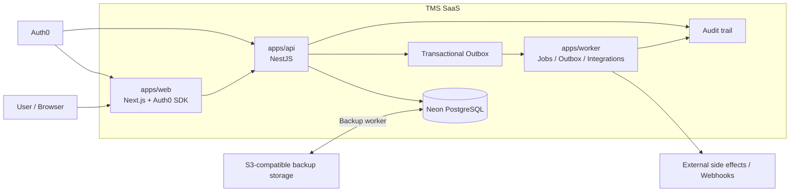
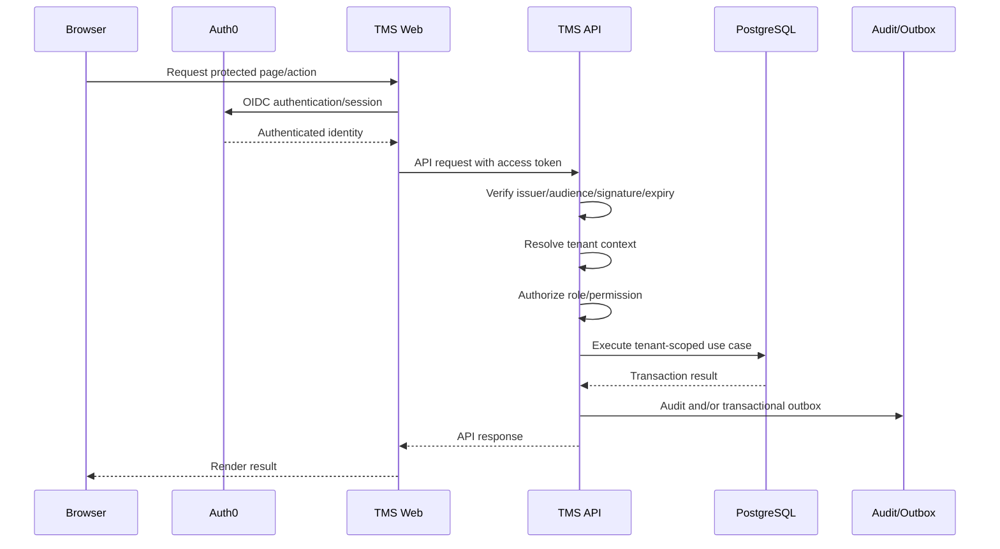
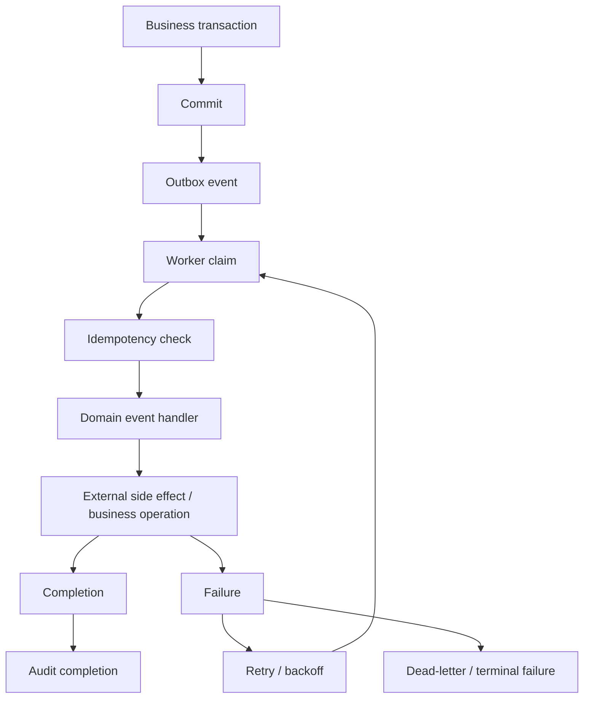
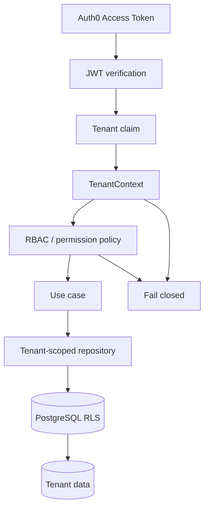
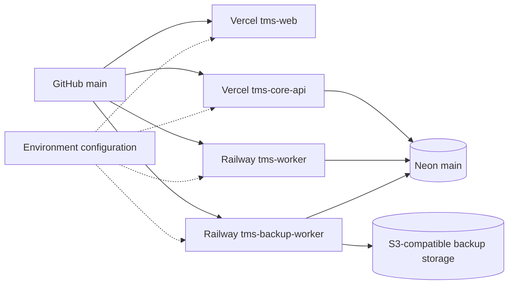
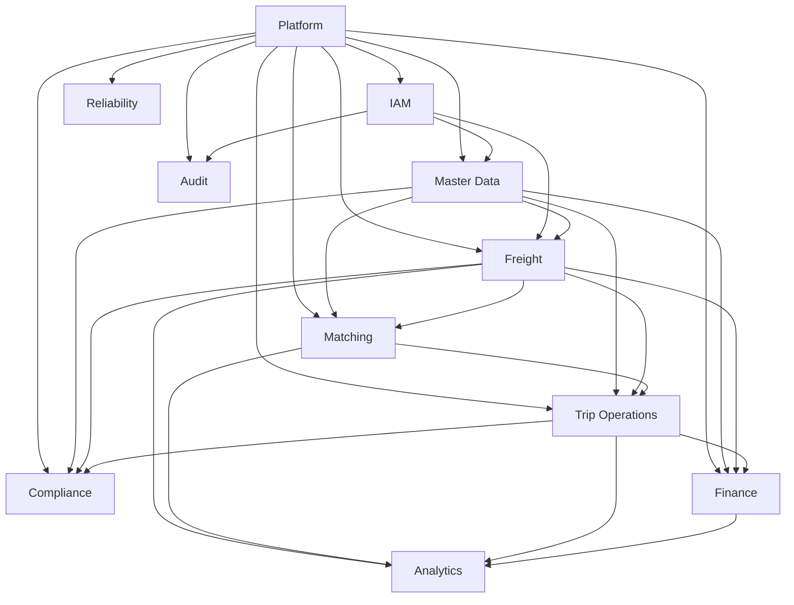

# TMS — Technical Architecture Diagrams

Date: 2026-09-20
Stage: CHAT 07 — Technical Diagrams
Canonical repository: `alexoaraujo83/TMS`
Canonical branch: `main`

## Purpose

This document turns the already-established architecture into explicit technical diagrams. It does **not** repeat repository discovery/inventory and does not claim runtime evidence that has not been independently proven.

The diagrams are intentionally aligned with the existing contracts in:

- `docs/architecture/FOUNDATION.md`
- `docs/architecture/DOMAIN-MAP.md`
- `docs/SSOT-OPERATIONS.md`
- `docs/audit/EVIDENCE-LEDGER-2026-09-17.md`

## 1. System topology

### Architectural invariants

- The Web application does not access PostgreSQL directly.
- The API is the business-rule boundary.
- PostgreSQL is the transactional source of truth.
- Outbox records are created in the same transaction as the business mutation.
- Worker processing is asynchronous and must be idempotent.
- Audit is explicit for security and business-sensitive operations.
- Auth0 authenticates identities; TMS remains authoritative for tenant membership, roles and permissions.

## 2. Synchronous request / authorization flow

The runtime gate that remains open is not the existence of these components; it is end-to-end evidence for the protected production path, including a newly issued real TMS Access Token and tenant/RBAC behavior.

## 3. Asynchronous outbox / worker flow

Worker processing must remain tenant-scoped and idempotent. Current operational evidence establishes deployment state separately from proof that a current production tenant lifecycle is configured and actively exercising Durable Jobs.

## 4. Tenant and authorization boundary

The intended defense-in-depth chain is:

`identity → token validation → tenant context → authorization → tenant-scoped repository → database constraints/RLS`.

## 5. Deployment and operational topology

This topology describes intended system relationships. It must not be interpreted as proof that all environment variables are identical across development, staging and production.

## 6. Domain dependency map

Forbidden coupling remains explicit:

- Web → database is forbidden.
- Domain modules may not import another module's private persistence implementation.
- Finance must not mutate Freight implicitly.
- Worker handlers must not bypass tenant authorization.
- AI/optimization may recommend but cannot silently mutate transactional state.

## 7. Blocker overlay

The diagrams must be read together with the current blocker routing:

| Blocker | Architecture surface | Current consequence |
|---|---|---|
| BLK-001 — Environment drift | Deployment topology | development/staging must not be destructively synchronized before ownership and active consumers are established. |
| BLK-002 — Worker deployment freshness / tenant lifecycle | Async topology | deployment evidence is separate from proof of configured tenant workload; no invented tenant IDs. |
| BLK-003 — Backup/DR readiness | Backup topology | recurring execution, retention and approved RPO/RTO remain operational gates. |
| BLK-004 — Runtime application coverage | Request flow | protected route/permission/runtime smoke remains required. |
| BLK-005 — Functional traceability | Domain/request flow | requirement → operation → runtime evidence remains incomplete. |
| BLK-008 / AUTH0-REAL-TOKEN-01 | Auth flow | newly issued real production Access Token must be validated end-to-end before the IAM/Auth0 gate is closed. |

## 8. Execution routing after CHAT 07

CHAT 07 establishes the technical visualization baseline without closing the existing blockers.

Operational priority remains:

`CI current → Runtime → Environment parity → Worker/Outbox → Backup/DR → Frontend → Regression`.

No diagram is treated as E2/E3/E4 evidence by itself.
